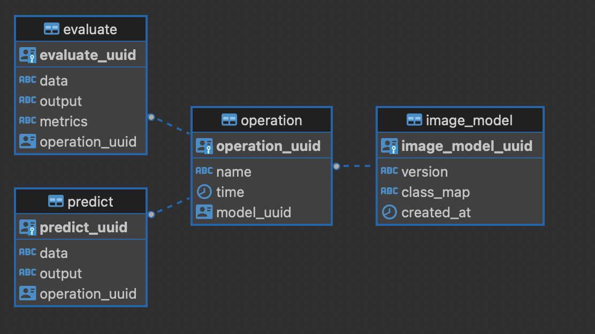

### Tools used
1. Python 3.10.4
2. FastAPI
3. Keras (Tensorflow)
4. Pydantic

### Directory structure
```
app
├── datamodel
│   ├── crud.py (DB operation)
│   ├── database.py (DB utils eg. create DB)
│   ├── models.py (DB models)
├── routers
│   ├── modelling.py (modelling api i.e. train, evaluate and predict)
│   ├── status.py (status api i.e. metadata and history)
├── schema
│   ├── __init__.py (Schema import place)
│   ├── schema.py (DB and Response Schema)
├── scripts
│   ├── db_scripts.py (DB queries)
│   ├── learning.py (modelling functions)
├── config.py (Application config)
├── constants.py (Constants and Enums)
├── dependencies.py (API dependencies)
├── main.py (APP main)
├── utils.py (utils)
```


### Database


#### Image model
Table to store model details
1. version (str/unique): version of the model.
2. class_map (json): map to index to class. used while prediction.
3. created at (datetime): time of model creation.

#### Operation
Table to store every operation done by user. Operations are *train, evaluate and predict*.
1. name (str): name of operation. train, evaluate or predict.
2. time (datetime): time of operation.
3. model_uuid (uuid): model on which operation is performed.

#### Evaluate
Table to store metrics related to evaluation
1. data (str): path of dataset.
2. output (str): accuracy of model.
3. metrics (str): loss of model.
4. operation_uuid (str): operation uuid of the evaluate operation.

#### Predict
Table to store prediction related metrics
1. data (str): path of image.
2. output (str): Output class of image.
3. operation_uuid (str): operation uuid of the evaluate operation.
