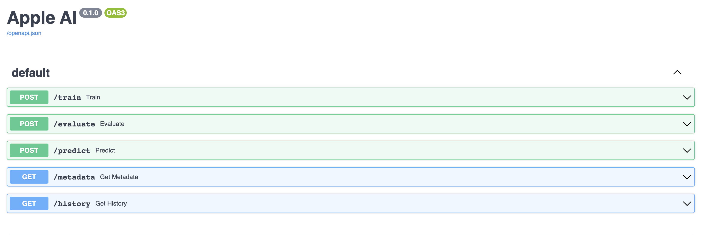

# ML Backend

A web-based ML service to handle requests to either retrain a model with new dataset or analyze an image against the model. This app setups a database to 
store classification results per image sent to the application for further review.

### APIs implemented

1. GET: `/metadata` </br>
route that returns versioned model information that are available on the server.
2. POST: `/train` </br>
route that trains a new model with labeled dataset from the request. </br>
Arguments:
   1. model_version: model version
   2. File: zip file with class folder structure.
3. POST: `/evaluate` </br>
route that accepts folder of images and model version and evaluates the performance of a version.
Arguments:
   1. model_version: model version
   2. File: zip file with class folder structure.
4. POST: `/predict` <br>
route that accepts a single valid image file in the request to be analyzed and returns the class.
Arguments:
   1. model_version: model version
   2. File: single image file.
5. GET: `/history` </br>
route that returns all historical predictions and evaluations saved in the database.

### How to run

1. Create a separate environment.
2. Install requirement.txt
   `pip install -r requirement.txt`
3. Setup DB variable in local_run.py.
```python
    environ["DB_USER"] = "postgres"
    environ["DB_PASSWORD"] = "12345678"
    environ["DB_HOST"] = "localhost"
    environ["DB_PORT"] = "5432"
    environ["DB_NAME"] = "mlapp"
```
4. Run local_run.py
5. Open `http://localhost:8000/api/docs`


